# 枫短链平台
## SaaS 短链接系统，为企业和个人提供一个高效、安全和可靠的短链接管理平台，平台提供短链接精确的追踪分析功能，并有效应对高峰期跳转访问并发
## 技术架构：SpringBoot3.x + SpringCloudAlibaba + Nacos + Sentinel + RocketMQ + ShardingSphere + Redis + MySQL + Redisson
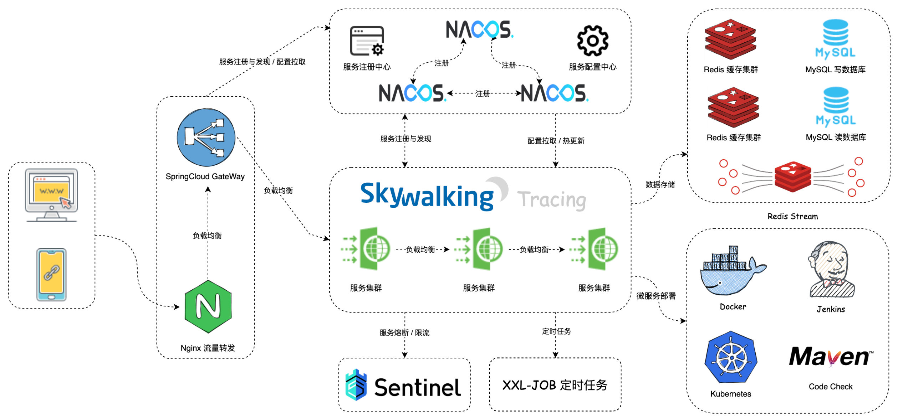
## 什么是枫短链系统？
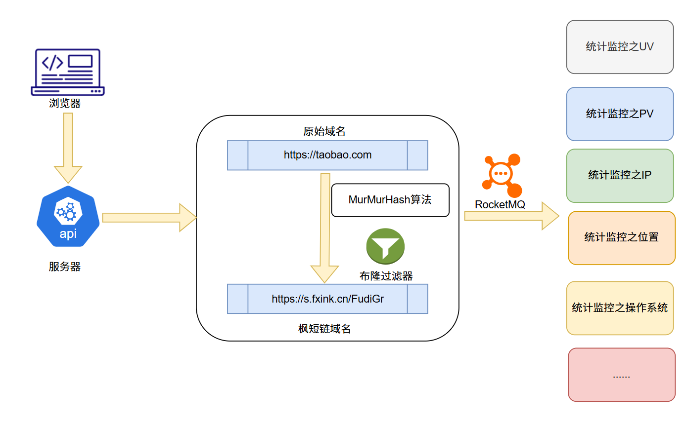
## 详细介绍：
1. 生成唯一标识符：当用户输入或提交一个长 URL 时，短链接服务会生成一个唯一的标识符或者短码。
2. 将标识符与长 URL 关联：短链接服务将这个唯一标识符与用户提供的长 URL 关联起来，并将其保存在数据库或者其他持久化存储中。
3. 创建短链接：将生成的唯一标识符加上短链接服务的域名(例如：http://s.fxink.cn/)作为前缀，构成一个短链接。
4. 重定向：当用户访问该短链接时，短链接服务接收到请求后会根据唯一标识符查找关联的长 URL，然后将用户重定向到这个长 URL。
5. 跟踪统计：一些短链接服务还会提供访问统计和分析功能，记录访问量、来源、地理位置等信息。
## 应用场景
短链接经常出现在咱们日常生活中，大家总是能在某些活动节日里收到各种营销短信，里边就会出现短链接。
淘宝、抖音、快手、微博等场景都需要短链接。大家在转发淘宝商品、抖音短视频时会有段文本，其中就有短链接。
举例：
> 6.17 复制打开抖音，看看【雷军的作品】大家小夜灯一般都装在哪些地方？听说有的朋友最多在家... https://v.douyin.com/iU2rFAdB/ C@u.SY 08/27 UYm:/

通过短链接帮助企业在营销活动中，识别用户行为、点击率等关键信息监控。
主要作用包括但不限于以下几个方面：
* 提升用户体验：用户更容易记忆和分享短链接，增强了用户的体验。
* 节省空间：短链接相对于长 URL 更短，可以节省字符空间，特别是在一些限制字符数的场合，如微博、短信等。
* 美化：短链接通常更美观、简洁，不会包含一大串字符。
* 统计和分析：可以追踪短链接的访问情况，了解用户的行为和喜好。
## 项目质量
> 短链接项目采用 SaaS 方式开发。SaaS代表“软件即服务”（Software as a Service），与传统的软件模型不同，SaaS 不需要用户在本地安装和维护软件，而是通过互联网直接访问在线应用程序。

### 既然是 SaaS 系统，那势必会带来 N 多个问题。在我看来，问题即项目亮点：
* 海量并发：可能会面对大量用户同时访问的情况，尤其在高峰期，这会对系统的性能和响应速度提出很高的要求。
* 海量存储：可能需要存储大量的用户数据，包括数据库、缓存等，需要足够的存储空间和高效的存储管理方案。
* 多租户场景：通常支持多个租户共享同一套系统，需要保证租户间的数据隔离、安全性和性能。
* 数据安全性：需要保证用户数据的安全性和隐私，防止未经授权的访问和数据泄露。
> 项目实现过程中会充分考虑以上问题，最终实现高可用、可扩展、支持海并发以及存储的 SaaS 短链接系统。
## 部署项目
### 拉取代码
```shell
  git clone https://github.com/mapleplus/feng-shortlink.git
```
### 前端
1. 需要node `16.20.1` 环境，下载地址：https://nodejs.org/download/release/v16.20.1 安装完成后分别执行检验是否显示版本号（有就代表成功）：`node -v` 和 `npm -v`
2. [Windows安装多版本node环境教程](https://blog.csdn.net/qq_38405436/article/details/132279098)
3. Mac多版本node
```shell
   # 安装 16.20.0 版本的 Nodejs
   n 16.20.0
   
   # 安装完成后，执行切换
   sudo n 16.20.0
   
   # 切换成功后，输入 node -v 查看版本是否正确
   node -v
```
4. 启动前端
```shell
   npm install
   npm run dev
```
### 后端
1. 部署启动Nacos https://nacos.io/docs/v2/guide/admin/deployment/
2. Redis & MySQL 这里不多说 网上都有教程
3. 部署启动RocketMQ https://rocketmq.apache.org/zh/docs/quick-start/
3. [Windows修改本地hosts](https://blog.csdn.net/Everglow___/article/details/120734455) [Mac修改本地hosts](https://blog.csdn.net/YangljHjr/article/details/133804674) 然后配置好域名`127.0.0.1 baidu.com`
4. JDK要求17+ [Windows JDK](https://www.azul.com/downloads/?version=java-17-lts&os=Windows&package=jdk#zulu) [Mac JDK](https://www.azul.com/downloads/?version=java-17-lts&os=Macos&package=jdk#zulu)
5. 服务配置
* 后管admin: 
  * application.yml
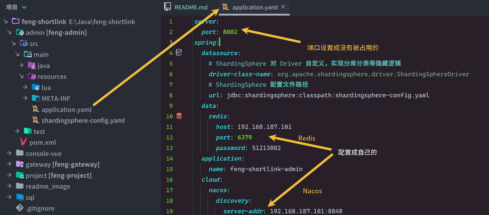
  * shardingsphere-config.yml

* 网关gateway:
  * application.yml
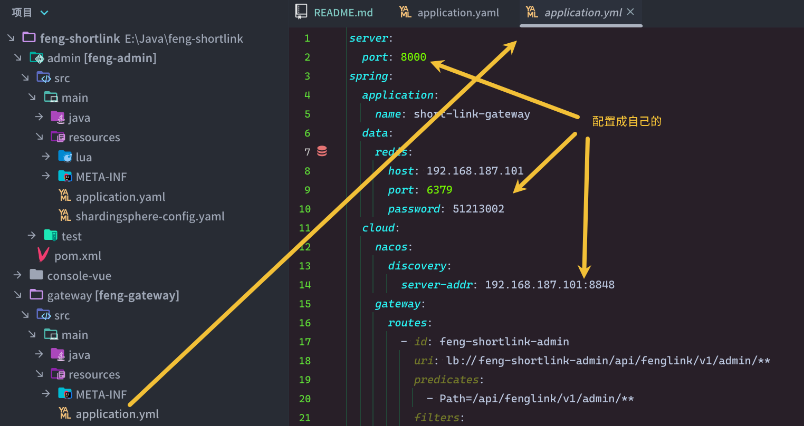
* 短链接project:
  * application.yml

  * shardingsphere-config.yml
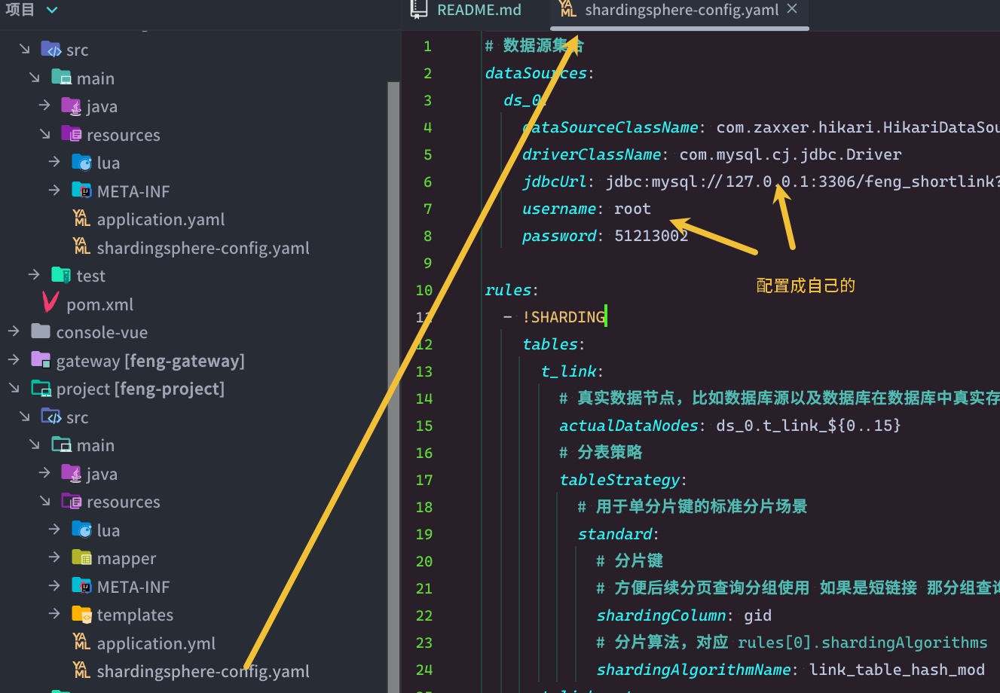
6. 启动项目
分别启动3个后端服务后再前启动前端
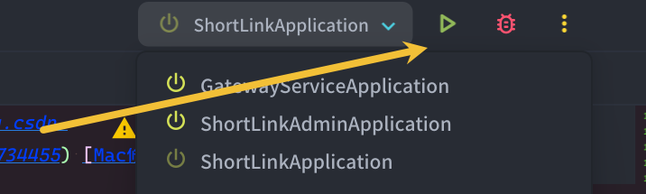
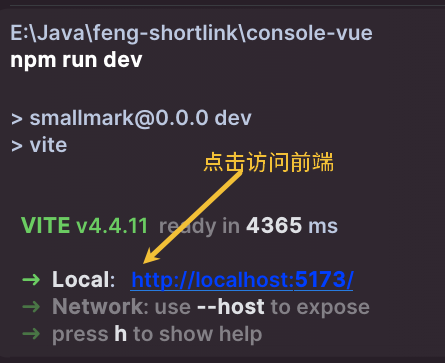
## 项目演示
### 在线地址：http://www.fxink.cn

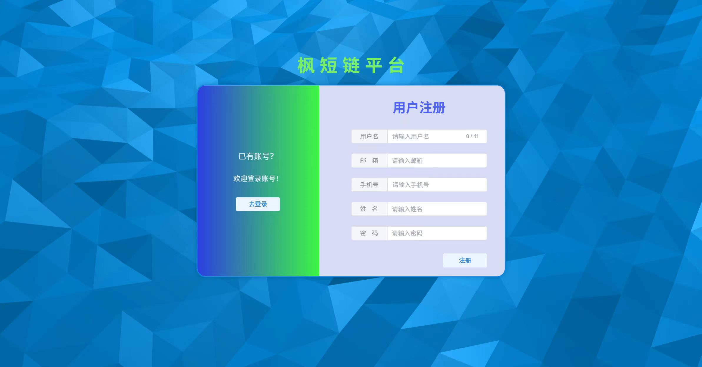
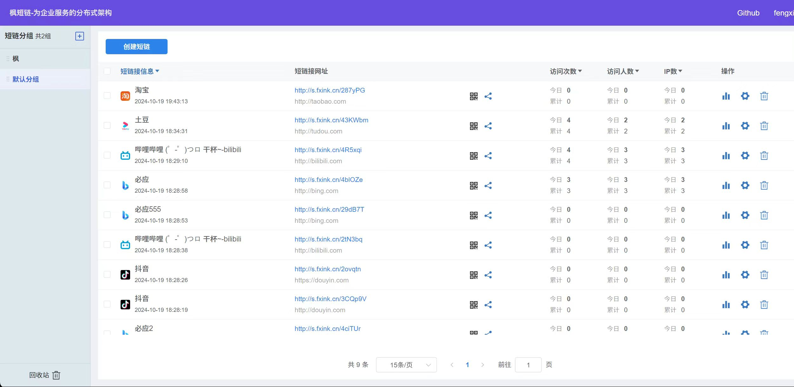
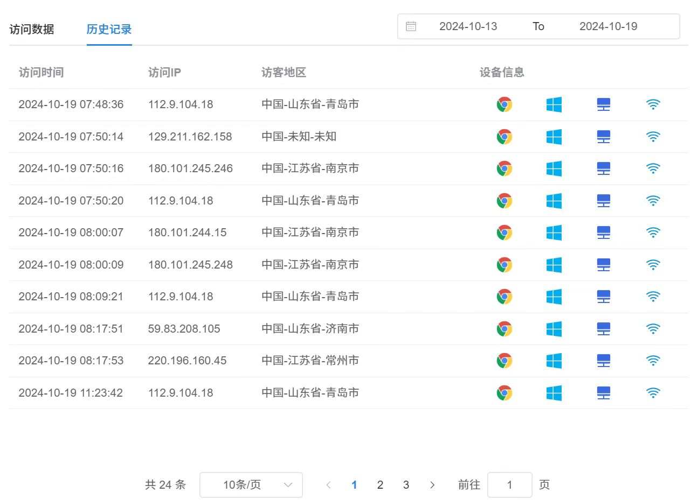
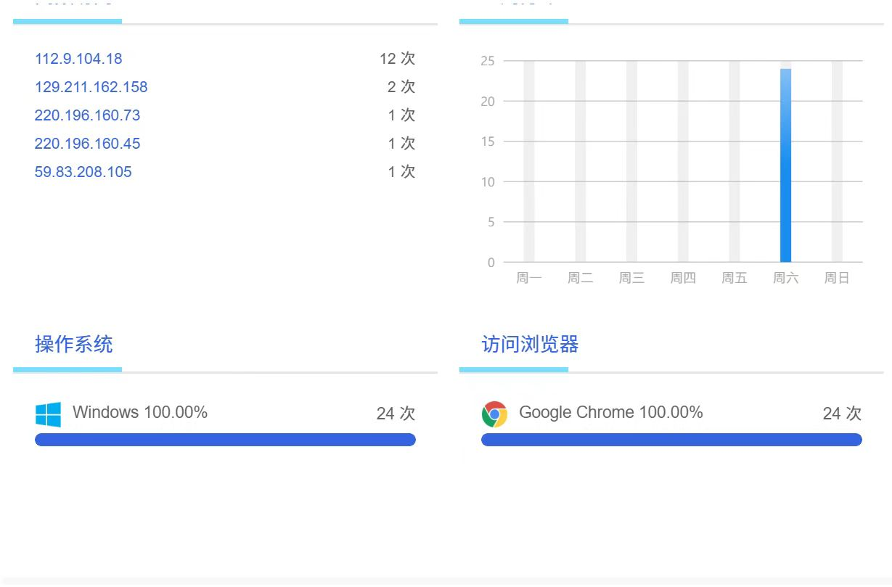
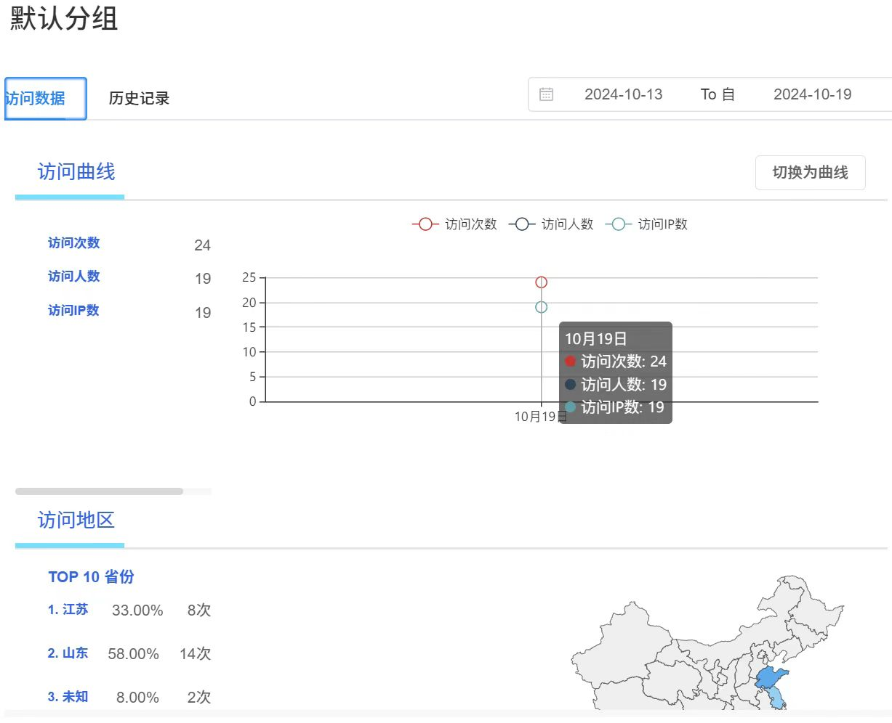